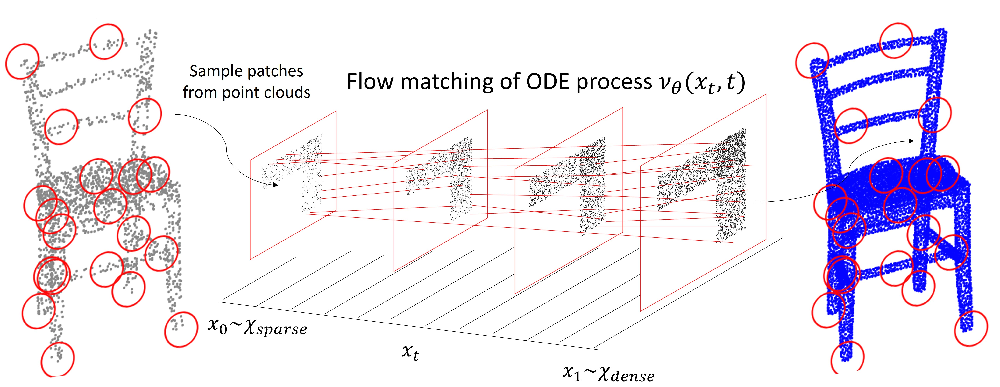

# PUFM++
PUFM++: Point Cloud Upsampling via Enhanced Flow Matching


 [arXiv](https://arxiv.org/abs/2501.15286)

This is the official PyTorch implementation of our paper "PUFM++: Point Cloud Upsampling via Enhanced Flow Matching".



## Abstract

Recent advances in generative modeling have demonstrated strong promise for high-quality point cloud upsampling. In this work, we present PUFM++, an enhanced flow-matching framework for reconstructing dense and accurate point clouds from sparse, noisy, and partial observations. PUFM++ improves flow matching along three key axes: (i)~geometric fidelity, (ii)~robustness to imperfect input, and (iii)~consistency with downstream surface-based tasks. We introduce a two-stage flow-matching strategy that first learns a direct, straight-path flow from sparse inputs to dense targets, and then refines it using noise-perturbed samples to approximate the terminal marginal distribution better. To accelerate and stabilize inference, we propose a data-driven adaptive time scheduler that improves sampling efficiency based on interpolation behavior. We further impose on-manifold constraints during sampling to ensure that generated points remain aligned with the underlying surface. Finally, we incorporate a recurrent interface network (RIN) to strengthen hierarchical feature interactions and boost reconstruction quality. Extensive experiments on synthetic benchmarks and real-world scans show that PUFM++ sets a new state of the art in point cloud upsampling, delivering superior visual fidelity and quantitative accuracy across a wide range of tasks.

|  |  |  |
|----------------------|----------------------|----------------------|
| DDPM              | PUDM             | Ours              |


## Installation

* Install the following packages

```
python==3.9
torch==1.13
numpy==1.25.2
open3d==0.17.0
einops==0.3.2
scikit-learn==1.3.1
tqdm==4.62.3
h5py==3.6.0
```

* Install the built-in libraries

```
cd models/pointops
python setup.py install
cd ../../Chamfer3D
python setup.py install
cd ../emd_assignment
python setup.py install
```

## Data Preparation
Please download [ [PU1K](https://github.com/guochengqian/PU-GCN) ] and [ [PUGAN](https://github.com/liruihui/PU-GAN) ].
```
# For generating test data, please see **dataset/prepare_data.py**
cd dataset

# We can generate 4x test set of PUGAN:
python prepare_data.py --input_pts_num 2048 --R 4 --mesh_dir mesh_dir --save_dir save_dir
```

For more information, please refer to [ [Grad-PU](https://github.com/yunhe20/Grad-PU) ]

## Quick Start
We have provided the pretrained models in this [[link](https://drive.google.com/file/d/1vjqawPpqCArqulmBK2kcdeeMQf_P-Bnk/view?usp=sharing)], so you can directly use them to reproduce the results.

* PU-GAN
```
# 4X on one single point cloud
python test_pufm.py --model pufm --test_input_path example/camel.xyz --up_rate 4
# 11X, upsampled point clouds
python test_pufm_arbitrary.py --model pufm_w_attn --dataset pugan --test_input_path /data/PU-GAN/input_2048_4X/input_2048/ --up_rate 11
# 4X on PUGAN evaluation, upsampled point clouds using PUFM
python eval_pufm.py --model pufm --dataset pugan --test_input_path /data/PU-GAN/input_2048_4X/input_2048/ --up_rate 4
# 4X on PUGAN evaluation, upsampled point clouds using PUFM_w_attn
python eval_pufm.py --model pufm_w_attn --dataset pugan --test_input_path /data/PU-GAN/input_2048_4X/input_2048/ --up_rate 4
# 16X on PUGAN evaluation, upsampled point clouds
python eval_pufm.py --model pufm_w_attn --dataset pugan --test_input_path /data/PU-GAN/input_2048_4X/input_2048/ --up_rate 16
```

## Training

If you want to train our model yourself, you can try the following commands.

* PU1K

```
python train_pufm.py
```

## Acknowledgments

Our code is built upon the following repositories: [PU-GCN](https://github.com/guochengqian/PU-GCN), [PU-GAN](https://github.com/liruihui/PU-GAN) and [Grad-PU]([https://github.com/CVMI-Lab/PAConv](https://github.com/yunhe20/Grad-PU)). Thanks for their great work.

## Citation

If you find our project is useful, please consider citing us:

```
@InProceedings{ZSLiu_2025,
    author    = {Zhi-Song Liu and Chenhang He and Roland Maier and Andreas Rupp},
    title     = {PUFM++:PointCloudUpsamplingviaEnhancedFlow Matching},
    booktitle = {arXiv:2501.15286},
    year      = {2025}
}
```


